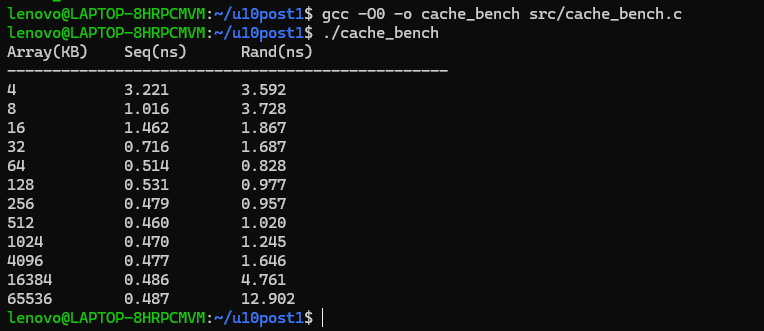

# Laboratorio Unidad 10 - Jerarquía de Caché

## Objetivo

Analizar el comportamiento de la jerarquía de memoria de un procesador moderno mediante experimentos de acceso a memoria. Se busca identificar los niveles de caché presentes en el sistema y comparar la latencia de acceso secuencial y aleatorio para observar el efecto de la localidad espacial, los cache miss y los TLB miss.

## Descripción
Implementación de un benchmark en C para medir la latencia de acceso a memoria utilizando arreglos de diferentes tamaños, observando el efecto de la jerarquía de caché (L1, L2, L3 y RAM).

## Estructura del proyecto
- src/ → código fuente en C
- capturas/ → evidencias de ejecución
- README.md → documentación y análisis

## Herramientas
- Ubuntu/Linux
- GCC
- perf
- time

## Archivos
- cache_bench.c → benchmark de caché

## Compilación

```bash
gcc -O0 -o cache_bench src/cache_bench.c
```
## Ejecucion
```bash
./cache_bench
```
## Checkpoint 1: Detección de caché

Se consultó la jerarquía de caché del procesador mediante los archivos del sistema Linux ubicados en:

/sys/devices/system/cpu/cpu0/cache/

### Resultados

- L1 Datos: 48K
- L1 Instrucciones: 32K
- L2: 1280K
- L3: 24576K


## Checkpoint 2: Benchmark secuencial

Se ejecutó un benchmark de acceso secuencial a arreglos de distintos tamaños para medir la latencia promedio por byte.

### Resultados

| Tamaño (KB) | ns/byte |
|------------ |---------:|
| 4           | 0.946 |
| 8           | 0.973 |
| 16          | 0.873 |
| 32          | 0.889 |
| 64          | 0.886 |
| 128         | 0.524 |
| 256         | 0.486 |
| 512         | 0.464 |
| 1024        | 0.474 |
| 4096        | 0.476 |
| 16384       | 0.479 |
| 65536       | 0.472 |

### Análisis

Los tiempos obtenidos permanecen relativamente estables debido a la eficiencia de los mecanismos de caché y prefetch del procesador moderno. Aunque no se observan transiciones abruptas, el experimento permite apreciar el efecto de la jerarquía de memoria durante accesos secuenciales.


## Checkpoint 3: Acceso secuencial vs acceso aleatorio

Se implementó una segunda prueba utilizando acceso aleatorio mediante índices mezclados con el algoritmo Fisher-Yates para comparar el comportamiento de la jerarquía de memoria frente al acceso secuencial.

### Resultados

| Tamaño (KB) | Secuencial (ns) | Aleatorio (ns) |
|------------|----------------:|---------------:|
| 4 | 3.221 | 3.592 |
| 8 | 1.016 | 3.728 |
| 16 | 1.462 | 1.867 |
| 32 | 0.716 | 1.687 |
| 64 | 0.514 | 0.828 |
| 128 | 0.531 | 0.977 |
| 256 | 0.479 | 0.957 |
| 512 | 0.460 | 1.020 |
| 1024 | 0.470 | 1.245 |
| 4096 | 0.477 | 1.646 |
| 16384 | 0.486 | 4.761 |
|65536|0.487|12.902|

### Análisis

El acceso secuencial mantiene una latencia relativamente constante debido a la localidad espacial y a los mecanismos de prefetch implementados por el procesador.

Por el contrario, el acceso aleatorio reduce significativamente la efectividad de la caché, provocando un mayor número de cache miss. A medida que el tamaño del arreglo supera los niveles de caché, la diferencia entre ambos patrones se vuelve más evidente.

En tamaños grandes (varios MB), además de los cache miss, aparece una penalización adicional asociada al Translation Lookaside Buffer (TLB). Cuando el conjunto de datos supera la cantidad de páginas que pueden mantenerse en el TLB, aumentan los TLB miss, incrementando aún más la latencia del acceso aleatorio.



## Conclusiones

Los experimentos permitieron observar el impacto de la jerarquía de memoria sobre el rendimiento. El acceso secuencial presentó una latencia estable gracias a la localidad espacial y al prefetching del procesador. En contraste, el acceso aleatorio incrementó significativamente la latencia al aumentar el tamaño de los arreglos, evidenciando una mayor cantidad de cache miss y TLB miss. Los resultados obtenidos son consistentes con la teoría de cachés multinivel y traducción de direcciones en arquitecturas modernas.