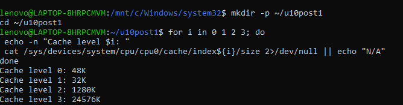
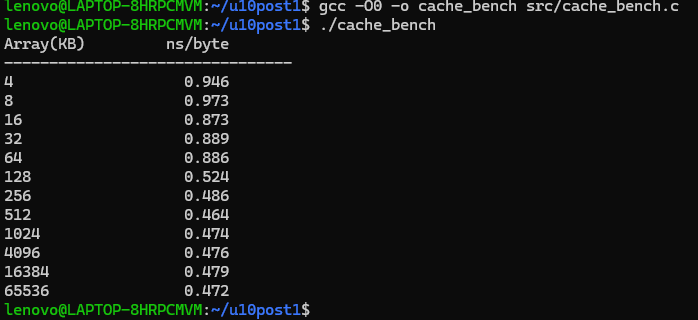

# Laboratorio Unidad 10 - Jerarquía de Caché

## Descripción
Implementación de un benchmark en C para medir la latencia de acceso a memoria utilizando arreglos de diferentes tamaños, observando el efecto de la jerarquía de caché (L1, L2, L3 y RAM).

## Estructura del proyecto
- src/ → código fuente en C
- capturas/ → evidencias de ejecución
- README.md → documentación y análisis

## Herramientas
- Ubuntu/Linux
- GCC
- perf
- time

## Archivos
- cache_bench.c → benchmark de caché

## Checkpoint 1: Detección de caché

Se consultó la jerarquía de caché del procesador mediante los archivos del sistema Linux ubicados en:

/sys/devices/system/cpu/cpu0/cache/

### Resultados

- L1 Datos: 48K
- L1 Instrucciones: 32K
- L2: 1280K
- L3: 24576K

## Checkpoint 2: Benchmark secuencial

Se ejecutó un benchmark de acceso secuencial a arreglos de distintos tamaños para medir la latencia promedio por byte.

### Resultados

| Tamaño (KB) | ns/byte |
|------------ |---------:|
| 4           | 0.946 |
| 8           | 0.973 |
| 16          | 0.873 |
| 32          | 0.889 |
| 64          | 0.886 |
| 128         | 0.524 |
| 256         | 0.486 |
| 512         | 0.464 |
| 1024        | 0.474 |
| 4096        | 0.476 |
| 16384       | 0.479 |
| 65536       | 0.472 |

### Análisis

Los tiempos obtenidos permanecen relativamente estables debido a la eficiencia de los mecanismos de caché y prefetch del procesador moderno. Aunque no se observan transiciones abruptas, el experimento permite apreciar el efecto de la jerarquía de memoria durante accesos secuenciales.

